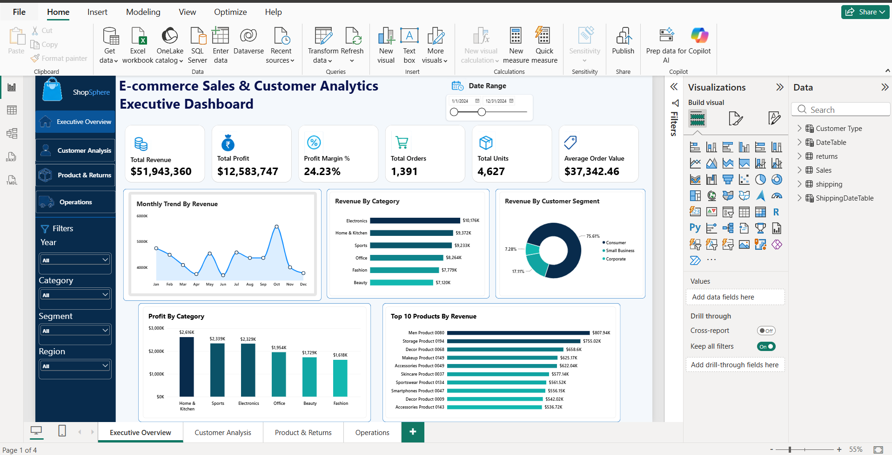
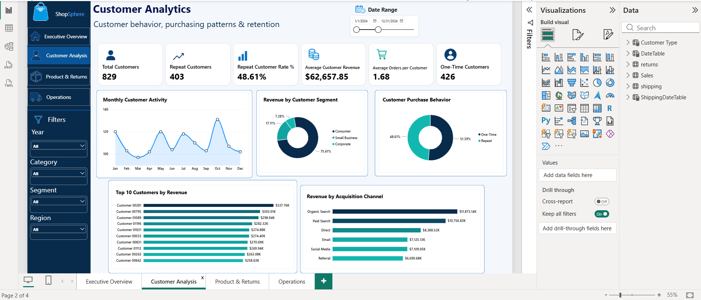
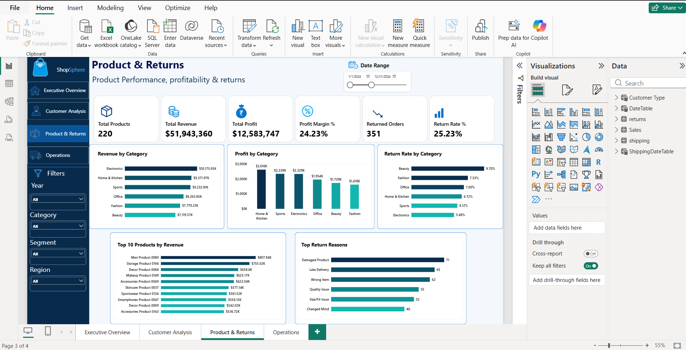
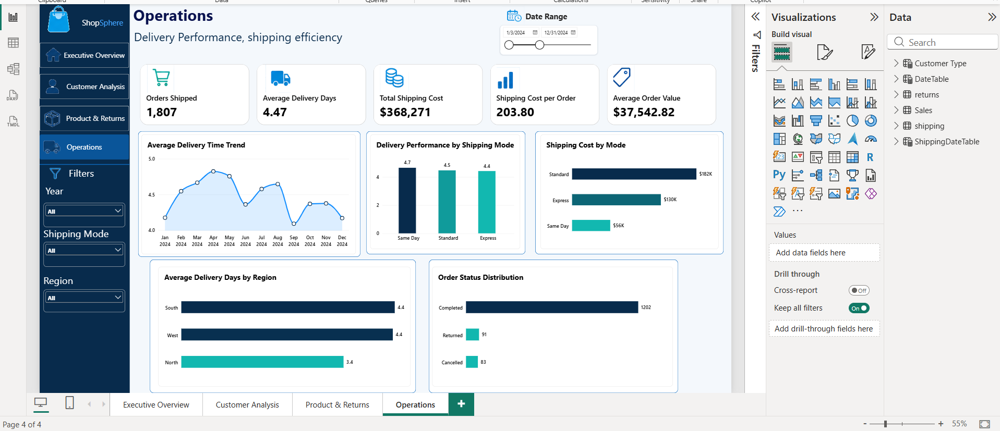

# E-commerce Sales & Customer Analytics

An end-to-end data analytics project analyzing e-commerce sales, customer behavior, product performance, profitability, returns, and operational performance using Excel, SQL, Python/Pandas, and Power BI.

## Project Overview

This project focuses on transforming raw e-commerce data into analysis-ready datasets and business insights.

The analysis covers the complete workflow from data validation and cleaning to exploratory analysis, SQL analysis, dashboard development, and business reporting.

## Business Problem

The business wants to understand its sales and customer performance across different products, regions, channels, and time periods.

The analysis focuses on questions such as:

- How are revenue, profit, and orders changing over time?
- Which categories and subcategories perform well?
- Which regions and sales channels generate the most revenue?
- Which customers contribute the most revenue and profit?
- What is the difference between one-time and repeat customers?
- How do returns affect business performance?
- How does delivery time vary by shipping mode?
- Which areas require further business attention?

## Objectives

- Clean and validate the raw datasets.
- Prepare analysis-ready data.
- Analyze sales and profitability trends.
- Analyze customer purchasing behavior.
- Evaluate product and category performance.
- Compare regional and sales-channel performance.
- Analyze returns and delivery performance.
- Build an interactive Power BI dashboard.
- Generate business-oriented insights from the analysis.

## Tools & Technologies

| Tool | Purpose |
|---|---|
| Excel | Data validation, cleaning, PivotTables and analysis |
| SQL | Data preparation, joins, aggregations and business queries |
| Python / Pandas | Data inspection, cleaning, transformation and analysis |
| Power BI | Data modeling, DAX, KPIs and interactive dashboards |

## Dataset

The project uses multiple related e-commerce datasets covering areas such as:

- Customers
- Orders
- Order Items
- Products
- Shipping
- Payments
- Returns / operational information

The datasets are stored in the `data` folder.

## Data Preparation

The following validation and cleaning activities were performed:

- Checked duplicate order IDs.
- Validated customer IDs.
- Standardized categorical values.
- Checked invalid quantities.
- Checked discount values.
- Validated relationships between datasets.
- Checked missing values.
- Prepared analysis-ready data for downstream analysis.

## Excel Analysis

Excel was used for initial data validation and business analysis.

The analysis includes:

- Revenue and profit analysis
- Monthly sales trends
- Category and subcategory analysis
- Regional analysis
- Sales-channel analysis
- Customer-level analysis
- Repeat customer analysis
- Return analysis
- Delivery-time analysis

The completed workbook is available in the `excel` folder.

## Python / Pandas Analysis

Python and Pandas were used for data inspection, cleaning, transformation, and exploratory analysis.

The analysis includes:

- Dataset inspection
- Data type validation
- Missing-value analysis
- Duplicate checks
- Data cleaning
- Data transformation
- Exploratory analysis
- Business-oriented analysis

The Jupyter notebook is available in the `python` folder.

## SQL Analysis

SQL was used to work with the structured datasets and answer business questions using:

- Table creation
- Data validation
- Joins
- Aggregations
- Filtering
- Grouping
- Calculated metrics
- Business analysis queries

The SQL scripts are available in the `sql` folder.

## Power BI Dashboard

Power BI was used to create an interactive dashboard covering:

- Executive Overview
- Sales Analysis
- Customer Analysis
- Product Analysis
- Operations

The dashboard includes KPIs, trends, comparisons, slicers, and interactive visualizations.

The `.pbix` file is available in the `powerbi` folder.

## Dashboard Preview

### Executive Overview



### Customer Analysis



### Product Analysis



### Operations



## Key Business Questions

The project addresses questions including:

1. What are the overall revenue, profit, and order metrics?
2. How do revenue and profit change over time?
3. Which categories and subcategories perform best?
4. Which regions generate the most revenue and profit?
5. Which sales channels contribute most to sales?
6. Which customers generate the highest revenue?
7. What proportion of customers are repeat customers?
8. Which products contribute significantly to revenue and profit?
9. How do returns affect sales performance?
10. How does delivery time vary by shipping mode?

## Project Structure

```text
ecommerce-sales-customer-analytics/
│
├── data/          # Project datasets
├── excel/         # Excel analysis
├── sql/           # SQL scripts
├── python/        # Python/Pandas analysis
├── powerbi/       # Power BI dashboard
├── screenshots/   # Dashboard screenshots
└── README.md      # Project documentation
│   └── Dashboard screenshots
│
└── README.md
